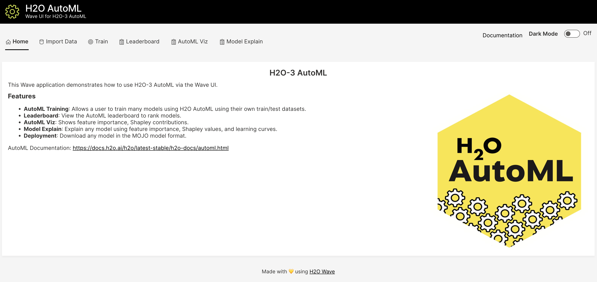

# Wave app for H2O AutoML

## System Requirements 
1. Python 3.6+
2. pip3

## Installation 

### 1. Run the Wave Server
Follow the instructions [here](https://wave.h2o.ai/docs/installation) to download and run the latest Wave Server, a requirement for apps. 

### 2. Setup Your Python Environment

```bash
$ git clone git@github.com:h2oai/wave-h2o-automl.git
$ cd wave-h2o-automl
$ make setup
$ source venv/bin/activate
```

### 3. Run the App

```bash
wave run src.app
```

Note! If you did not activate your virtual environment this will be:
```bash
./venv/bin/wave run src.app
```

### 4. View the App
Point your favorite web browser to [localhost:10101](http://localhost:10101)




